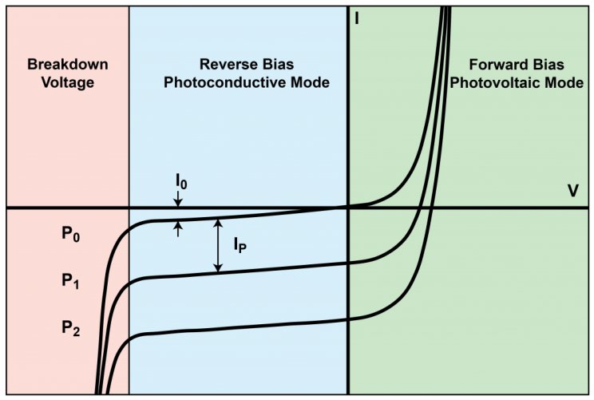
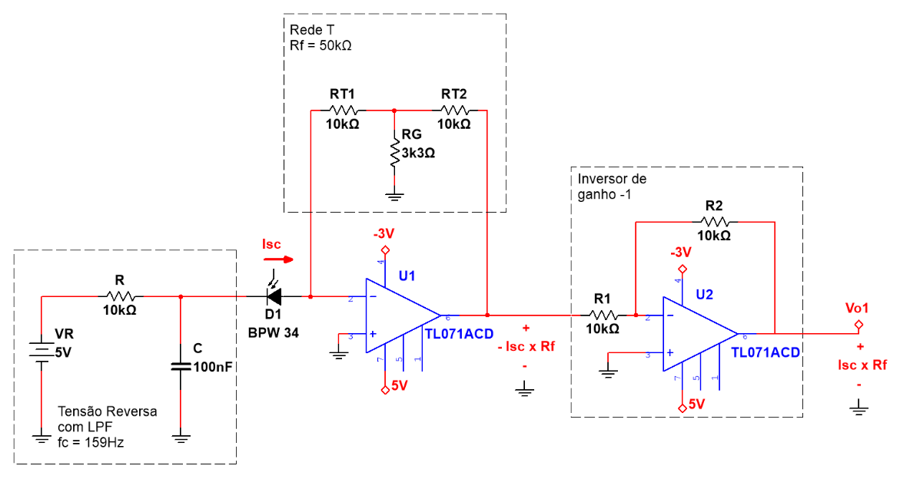
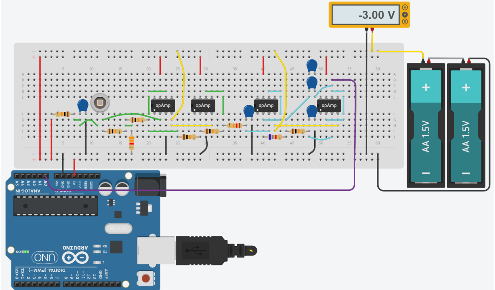
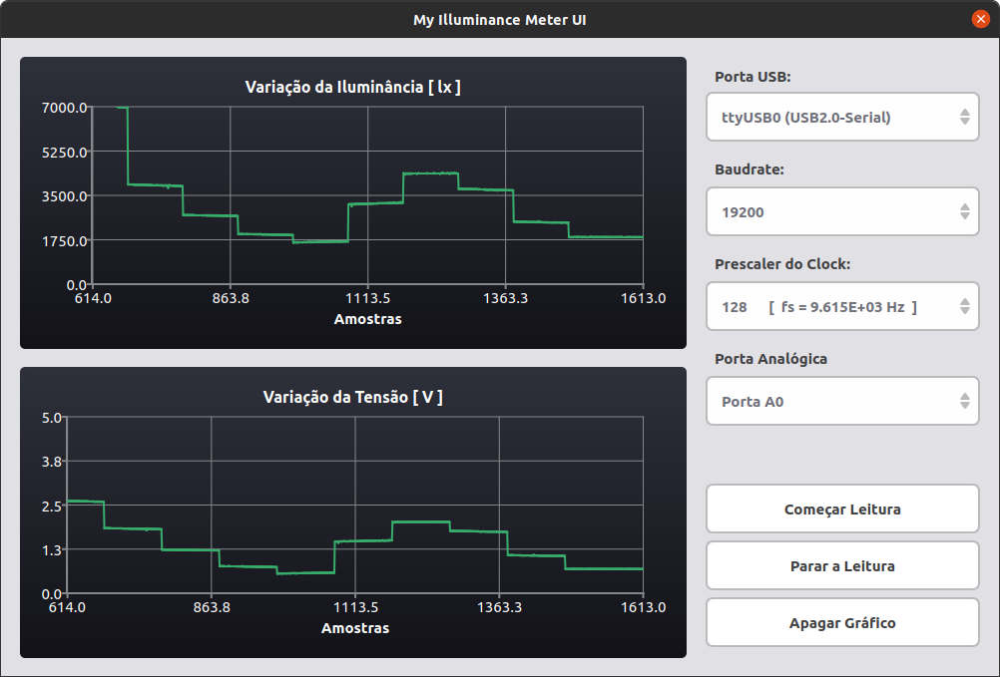

# My-IlluminanceMeter
This project implemented an illuminance measurement system, based on the BPW34 photodiode and was developed as practical work in the discipline "Measurement Systems" in the Electrical Engineering course at UFMG.  In addition to the data acquisition and processing system based on Arduino UNO, the project has a graphical data visualization interface developed in QT C ++.

## Hardware

For the polarization and supply of the BPW34 photodiode, we chose to polarize it using the photovoltaic mode, in order to obtain a greater region of linearity of the current curves by voltage of the device, as seen in the image below:

  

In order to stabilize the power supply signal, we built a simple low-pass filter with a frequency of around 159Hz. To increase the transconductance gain of the system, we use an opamp with feedback resistance in T-network in order to obtain considerable gains and minimize noise. Finally, in order to reinvert the opamp output signal, we use a second stage with unit gain. The final polarization circuit of the BPW34 can be seen in the figure below:

  

Finally, as a signal conditioner, we developed a bessel active 3rd order anti-aliasing filter set to a frequency of 1kHz (the projected minimum acquisition frequency is around 9kHz) that allows us to respect the Nyquist-Shannon criterion.

  

## Prototype

We will use the opamp TL071 for the project, as this opamp requires a bipolar supply voltage and accepts asymmetric supply, for the generation of the positive voltage we will use the Arduino's own 5V output and for the negative voltage we will use a configuration using 2 batteries of 1.5V in order to generate a voltage of -3V (warning: powering the opamp like this, we are aware that we will lose a range of values ​​due to the saturation of the TL071). Thus, the final prototype of the data acquisition circuit was as shown in the image below:

  

## UI

For the display and treatment of the collected data, a simple interface was developed using QT that allows, in addition to viewing the illuminance reading values, to control some of the Arduino ADC registers, in order to adjust the prescaler (controlling the acquisition frequency ) and which channel you want to read, and start and stop receiving as needed. This interface communicates with the Arduino via serial.

  

## Acquisition

To create the data acquisition routine in Arduino, we use the Free-running mode, in order to obtain higher sampling rates and to optimize the use of microcontroller resources. For that it is necessary to configure some ADC registers and one of the processor which are:

- ADMUX
- ADCSRA
- ADCSRB
- DIDR0
- SREG (processor)

How to configure each of these registers in order to obtain the expected result from the ADC can be read in more detail in the documentation present in the 'doc' folder of that repository.

Finally, it was necessary to create a routine for handling interruptions caused by the ADC whenever a sample was collected and a routine for handling data received from the interface through the serial.
